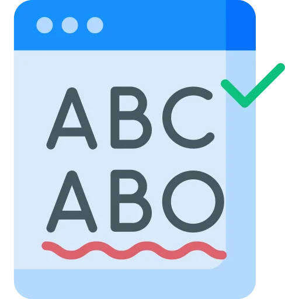
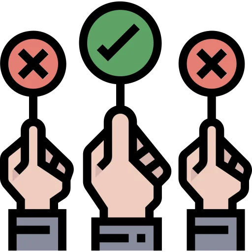
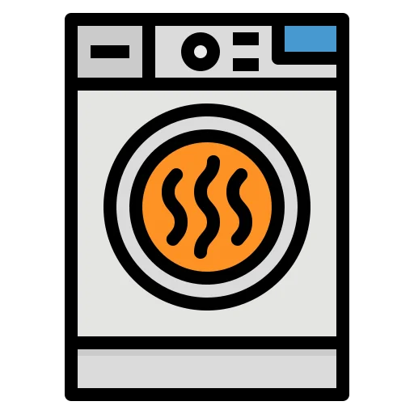
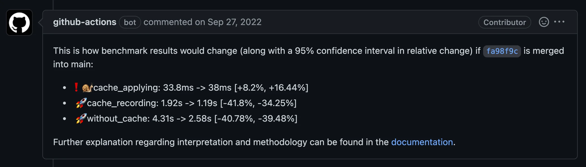
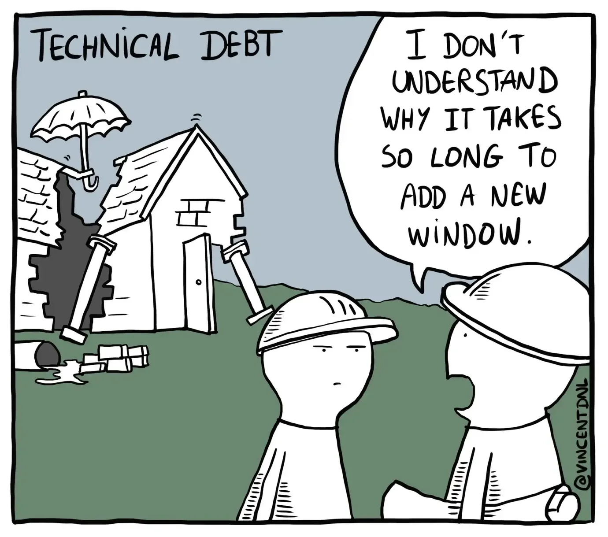
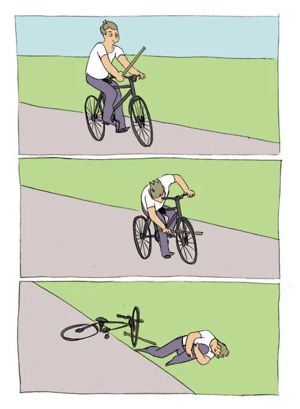

---
format:
  revealjs:
    css: style.css
    theme: simple
    revealjs-plugins:
      - a11y
    revealjs-a11y:
      # 0.2.3's menus introduce ARIA failures; retain our slide-menu handling.
      slide-menu-a11y: false
      menu: false
      # Use the extension's core accessibility fixes without extra UI/shortcuts.
      font-size-controls: false
      font-selection: false
      text-spacing: false
      transcript: false
      slide-change-cue: false
    slide-number: true
    code-line-numbers: false
    preview-links: auto
    keyboard: true
    touch: true
    help: true
    include-in-header: meta-tags.html
    include-after-body: accessibility.html
    link-external-newwindow: true
    google-analytics: "G-3BQ49J7KYH"
execute:
  echo: true
keywords: ["software-engineering", "r-packages", "best-practices", "CRAN"]
description-meta: "A guide to sustainable R package development through automated checks for documentation, exception handling, portability, code quality, and dependencies, plus repository instructions, skills, and prompts for terminal-based coding agents."
license: "CC0 1.0 Universal"
pagetitle: "Preventive Care for R Packages"
author-meta: "Indrajeet Patil"
date-meta: "`r Sys.time()`"
lang: "en"
dir: "ltr"
image: "media/social-media-card.webp"
image-alt: "Preview image for presentation about preventive care for R packages"
canonical-url: "https://www.indrapatil.com/preventive-r-package-care/"
---

## Preventive Care for R Packages {.nostretch style="text-align: center;"}

::: {style="text-align: center;"}

Indrajeet Patil

:::

```{r, echo=FALSE}
#| out-height: 390px
#| fig-alt: "A watering can waters a cardboard box in a plant pot, illustrating preventive package care."

```

::: {style="text-align: center; font-size: 0.7em; margin-top: 2em; color: #666;"}
Source code for these slides can be found [on GitHub](https://github.com/IndrajeetPatil/preventive-r-package-care/){style="text-decoration: underline;"}.
:::

# "Software engineering ought to produce sustainability." 
\- Mark Seemann (*Code That Fits in Your Head*)

# Target audience {.smaller}

As an R package developer, if you ever lay awake in the bed wondering:

- if the users are having a bad experience while using the package,
- if you will receive the dreaded CRAN email about archival, and
- if you will be able to update the package in time,

then this presentation is for you! 😊

# Before we begin

Don't miss the forest for the trees.

## <span class="visually-hidden">Scope of this presentation</span> {#section .smaller}

:::{.callout-important}

## It's not about the tools

I will rely heavily on GitHub as the hosting platform and GitHub Actions as the CI/CD framework. Even if you use neither, the broader takeaways should still be relevant. You can implement the necessary checks with preferred tech stack.

:::

<br>

:::{.callout-note}

## It's not *just* about CRAN

Following the recommended practices will make packages more robust to CRAN checks, but that benefit is *incidental*. You can follow these practices even if you never plan to submit to CRAN. The goal here is to improve user experience and reduce maintenance workload.

:::

<br>

:::{.callout-tip}

## It's not even about R

The practices outlined here are just as relevant to software development in any other programming language (just replace the package with module/library/etc.).

:::

## Iconography {.smaller}

<!-- column layout -->

:::: {.columns}

::: {.column width='15%'}

```{r, echo=FALSE}
#| fig-alt: ""
#| out-extra: 'role="presentation"'

```

:::

::: {.column width='35%'}

<br>
Overarching goal

:::

::: {.column width='15%'}

```{r, echo=FALSE}
#| fig-alt: ""
#| out-extra: 'role="presentation"'

```

:::

::: {.column width='35%'}

<br>
Problem to solve

:::

::::

<!-- column layout -->

:::: {.columns}

::: {.column width='15%'}

```{r, echo=FALSE}
#| fig-alt: ""
#| out-extra: 'role="presentation"'

```

:::

::: {.column width='35%'}

<br>
Bad user experience

:::

::: {.column width='15%'}

```{r, echo=FALSE}
#| fig-alt: ""
#| out-extra: 'role="presentation"'

```

:::

::: {.column width='35%'}

<br>
Maintenance headaches

:::

::::

<!-- column layout -->

:::: {.columns}

::: {.column width='15%'}

```{r, echo=FALSE}
#| fig-alt: ""
#| out-extra: 'role="presentation"'

```

:::

::: {.column width='35%'}

<br>
Tools

:::

::: {.column width='15%'}

```{r, echo=FALSE}
#| fig-alt: ""
#| out-extra: 'role="presentation"'

```

:::

::: {.column width='35%'}

<br>
Automation

:::

::::

# Digging the pit of success

How can software engineering improve sustainability

## Be always release-ready {.smaller}

<!-- column layout -->

:::: {.columns}

::: {.column width='70%'}

Based on research, *Accelerate* (Forsgren, Humble, & Kim, 2018) argues that the key difference between high-performing vs low-performing software teams is *the ability to make a release at the drop of a hat*.

For R packages, this translates to making sure that every commit on the `main`-branch is **release-ready**. 

That is, if you were asked to make a new release soon, you can be confident that the latest commit doesn't have any documentation issues, code quality issues, performance regressions, etc.

:::

::: {.column width='30%'}

```{r}
#| echo: false
#| out-width: "70%"
#| fig-alt: "Cover of Accelerate: The Science of Lean Software and DevOps, by Nicole Forsgren, Jez Humble, and Gene Kim."

```

:::

::::

. . . 

<br>


:::{style="background-color: #F3CCFF; padding: 20px; border-radius: 25px; text-align: center;"}

How can software engineering help to achieve this goal?

:::

## Fighting software entropy {.smaller}

The biggest reason why a software project becomes unsustainable is the unchecked accumulation of complexity.

. . . 

:::: {.columns}

::: {.column width='20%'}

```{r}
#| echo: false
#| fig-alt: ""
#| out-extra: 'role="presentation"'

```

:::

::: {.column width='80%'}

**Software engineering is the active and conscious process of preventing complexity from growing.**

It provides the methodology to make sure that the software works as intended and to ensure that it stays that way.

:::

::::

. . . 

:::{style="font-size: 25px;"}

:::: {.columns}

::: {.column width='20%'}

```{r}
#| echo: false
#| fig-alt: ""
#| out-extra: 'role="presentation"'

```

:::

::: {.column width='80%'}

Software development is an inherently complex process. To make it more manageable, we break it down into checklists of best practices—each designed to stave off complexity—so that we don't forget about them.

Following each item on a checklist is a small improvement, but constantly keeping an eye on internal quality prevents software entropy from growing. Although software engineering is more than about automating this process, automation is undoubtedly an important part of it.

:::

::::

:::

# "The only way to go fast, is to go well."
\- Robert C. Martin

# R package development

Using automation to tick checklists for various aspects of package development.

## Plan

First, you will see the checklists to tick, and then the details on how to build infrastructure to ensure that none of the checklist items are forgotten.

- [Documentation](#documentation) 

- [Exception handling](#warnings)

- [Portability](#portability)

- [Code quality](#codequality)

- [Dependency management](#dependency)

- [LLM-readiness](#llm-readiness)

## Checklist for documentation {.smaller}

<!-- column layout -->

:::: {.columns}

::: {.column width='10%'}

```{r, echo=FALSE}
#| fig-alt: ""
#| out-extra: 'role="presentation"'

```

:::

::: {.column width='90%'}

:::{style="color: blue; text-align: center;"}

**For a good user experience, make sure that the docs are plentiful, valid, and up-to-date.**

:::

:::

::::

| Item                                                      |
| :-------------------------------------------------------- |
| Make sure there are enough examples in the documentation. |
| Make sure all README examples are working.                |
| Make sure all examples in help pages are working.         |
| Make sure examples in vignettes are working.              |
| Make sure all URLs are valid.                             |
| Make sure there are no spelling mistakes.                 |
| Make sure generated help-page HTML is valid.              |

## Checklist for exception handling {.smaller}

<!-- column layout -->

:::: {.columns}

::: {.column width='10%'}

```{r, echo=FALSE}
#| fig-alt: ""
#| out-extra: 'role="presentation"'

```

:::

::: {.column width='90%'}

:::{style="color: blue; text-align: center;"}

**To reduce maintenance headaches, make sure that warnings are easily detected for further scrutiny and forthright dealt with.**

:::

:::

::::

<br>

| Item                                                     |
| :------------------------------------------------------- |
| Make sure examples in README produce no warnings.        |
| Make sure examples in help pages produce no warnings.    |
| Make sure examples in vignettes produce no warnings.     |
| Make sure tests produce no extrinsic warnings.           |

## Checklist for portability {.smaller}

<!-- column layout -->

:::: {.columns}

::: {.column width='10%'}

```{r, echo=FALSE}
#| fig-alt: ""
#| out-extra: 'role="presentation"'

```

:::

::: {.column width='90%'}

:::{style="color: blue; text-align: center;"}

**For a good user experience, make sure that package would work as expected across diverse settings.**

:::

:::

::::

<br>

| Item                                                         |
| :----------------------------------------------------------- |
| Make sure package passes checks on commonly used OS.         |
| Make sure package passes checks on all supported R versions. |
| ...                                                          |

::: {.small-note style="font-size: 0.6em;"}

The items on this list will vary significantly from package to package (e.g., does it work in different locales, with different compilers, etc.). Extend the list for your workflow!

:::

## Checklist for code quality {.smaller}

<!-- column layout -->

:::: {.columns}

::: {.column width='10%'}

```{r, echo=FALSE}
#| fig-alt: ""
#| out-extra: 'role="presentation"'

```

:::

::: {.column width='90%'}

:::{style="color: blue; text-align: center;"}

**To reduce maintenance headaches, make sure that the code is readable, maintainable, and follows agreed conventions.**

:::

:::

::::

<br>

| Item                                              |
| :------------------------------------------------ |
| Make sure the code follows a style guide.         |
| Make sure there are no known code quality issues. |
| Make sure there are no performance regressions.   |

## Checklist for dependency management {.smaller}

<!-- column layout -->

:::: {.columns}

::: {.column width='10%'}

```{r, echo=FALSE}
#| fig-alt: ""
#| out-extra: 'role="presentation"'

```

:::

::: {.column width='90%'}

:::{style="color: blue; text-align: center;"}

**To reduce maintenance headaches, make optional features fail clearly and detect breaking dependency changes early.**

:::

:::

::::

<br>

| Item                                                                         |
| :--------------------------------------------------------------------------- |
| Guard runtime features that require a suggested dependency.                  |
| Anticipate possible breaking changes coming from dependencies and act on it. |

# Documentation {#documentation}

Preventive care to make sure the docs are up-to-date.

# "Incorrect documentation is often worse than no documentation."
\- Bertrand Meyer

# <span class="visually-hidden">Documentation quality</span> {#section-1}
<!-- column layout -->

:::::{style="background-color: #A9F5A9; padding: 20px; border-radius: 25px;"}

:::: {.columns}

::: {.column width='10%'}

```{r, echo=FALSE}
#| fig-alt: ""
#| out-extra: 'role="presentation"'

```

:::

::: {.column width='90%'}

:::{style="color: blue; text-align: center;"}

**For a good user experience, make sure that the docs are plentiful, valid, and up-to-date.**

:::

:::

::::

:::::

# Make sure there are enough examples in the documentation.

## An example is worth a thousand words {.smaller}

<!-- column layout -->

:::: {.columns}

::: {.column width='10%'}

```{r, echo=FALSE}
#| fig-alt: ""
#| out-extra: 'role="presentation"'

```

:::

::: {.column width='90%'}

Access to abundant examples in help pages and vignettes provides a natural starting point for users to explore and experiment with the available functionality. 

Good examples are difficult to write, but any examples are better than none.

:::

::::

<br>

. . .

<!-- column layout -->

:::: {.columns}

::: {.column width='10%'}

```{r, echo=FALSE}
#| fig-alt: ""
#| out-extra: 'role="presentation"'

```

:::

::: {.column width='90%'}

Without enough expository examples, users are left to fumble their way into discovering the available functionality.

:::

::::

. . .

<br>

<!-- column layout -->

:::: {.columns}

::: {.column width='10%'}

```{r, echo=FALSE}
#| fig-alt: ""
#| out-extra: 'role="presentation"'

```

:::

::: {.column width='90%'}

::: {style="color: red;"}

**How to ensure that there are *enough* number of examples?**

:::

:::

::::

## Sources of documentation {.smaller}

There are three types of documents that constitute package documentation.

<!-- column layout -->

:::: {.columns}

::: {.column width='30%'}

:::{style="text-align: center;"}

**README.md**

:::

```{r, echo=FALSE}
#| fig-alt: ""
#| out-extra: 'role="presentation"'

```

:::

::: {.column width='5%'}

:::

::: {.column width='30%'}

:::{style="text-align: center;"}

**Help pages**

:::

```{r, echo=FALSE}
#| fig-alt: ""
#| out-extra: 'role="presentation"'

```

:::

::: {.column width='5%'}

:::

::: {.column width='30%'}

:::{style="text-align: center;"}

**Vignettes**

```{r, echo=FALSE}
#| fig-alt: ""
#| out-extra: 'role="presentation"'

```

:::

:::

::::

<br>

Therefore, we want to make sure that, when combined across these sources, there are enough examples to cover a significant proportion of available functionality.

## Maintaining example code coverage {.smaller}

<!-- column layout -->

:::: {.columns}

::: {.column width='9%'}

```{r, echo=FALSE}
#| fig-alt: ""
#| out-extra: 'role="presentation"'

```

:::

::: {.column width='91%'}

Use [`{covr}`](https://covr.r-lib.org/) to compute example code coverage (i.e. proportion of the source code that is executed when running examples in help pages and vignettes), and to ensure that it is above a certain threshold.

```{r, eval=FALSE}
#| code-line-numbers: false
package_coverage(type = c("examples", "vignettes"), commentDonttest = FALSE, commentDontrun = FALSE)
```

:::

::::

. . .

<!-- column layout -->

:::: {.columns}

::: {.column width='9%'}

```{r, echo=FALSE}
#| fig-alt: ""
#| out-extra: 'role="presentation"'

```

:::

::: {.column width='91%'}

Use a [GHA workflow](https://github.com/IndrajeetPatil/workflows/blob/main/.github/workflows/test-coverage.yaml) to automate checking that the code coverage via examples never drops below the chosen threshold.

:::

::::

. . .

:::{.callout-tip}

## Additional tips 

- The choice of threshold is subjective and context-sensitive. Chasing after 100% example code coverage is futile (since this would require exposing every exception in the examples).

- The examples not run or tested on CRAN can still be counted for computing code coverage.

- Vignettes not included in the package (the ones in `vignettes/` subdirectory or `.Rbuildignore`) will not contribute towards the code coverage. Ditto for `README`. You can adjust the threshold accordingly.

- You could also choose the threshold on a file basis (`covr::file_coverage()`).

:::

# Make sure all README examples are working.

## README documentation {.smaller}

<!-- column layout -->

:::: {.columns}

::: {.column width='10%'}

```{r, echo=FALSE}
#| fig-alt: ""
#| out-extra: 'role="presentation"'

```

:::

::: {.column width='90%'}

`README.md` provides a quick overview of the package API and can feature examples of key functions. 

Although breaking changes might be infrequent, when they do occur, the code in README may become defunct.

:::

::::

<br>

. . .

<!-- column layout -->

:::: {.columns}

::: {.column width='10%'}

```{r, echo=FALSE}
#| fig-alt: ""
#| out-extra: 'role="presentation"'

```

:::

::: {.column width='90%'}

`README.md` is probably the first and the most-visited document in a project and any broken examples therein are bound to confuse many users.

:::

::::

. . .

<br>

<!-- column layout -->

:::: {.columns}

::: {.column width='10%'}

```{r, echo=FALSE}
#| fig-alt: ""
#| out-extra: 'role="presentation"'

```

:::

::: {.column width='90%'}

::: {style="color: red;"}

**How to insure against broken code in README?**

:::

:::

::::

## Detecting broken README examples {.smaller}

<!-- column layout -->

:::: {.columns}

::: {.column width='10%'}

```{r, echo=FALSE}
#| fig-alt: ""
#| out-extra: 'role="presentation"'

```

:::

::: {.column width='90%'}

Use [`devtools::build_readme()`](https://devtools.r-lib.org/reference/build_rmd.html) to render `README.qmd` or `README.Rmd` in a clean R session against a temporary installation of the package. Broken code will make the render fail.

```{r, eval=FALSE}
#| code-line-numbers: false
devtools::build_readme()
```

:::

::::

<br>

. . .

<!-- column layout -->

:::: {.columns}

::: {.column width='10%'}

```{r, echo=FALSE}
#| fig-alt: ""
#| out-extra: 'role="presentation"'

```

:::

::: {.column width='90%'}

Use a [GHA workflow](https://github.com/IndrajeetPatil/workflows/blob/main/.github/workflows/check-extra.yaml) to automate checking that README can be successfully rendered on each commit.

:::

::::

. . .

:::{.callout-tip}

## Additional tips 

- If you are starting a new project, create README using [`usethis::use_readme_rmd()`](https://usethis.r-lib.org/reference/use_readme_rmd.html).

:::

# Make sure *all* examples in help pages are working.

## Broken examples in help pages {.smaller}

<!-- column layout -->

:::: {.columns}

::: {.column width='10%'}

<br>

```{r, echo=FALSE}
#| fig-alt: ""
#| out-extra: 'role="presentation"'

```

:::

::: {.column width='90%'}

:::{.callout-note}

## Types of examples

Help pages for exported functions should contain examples illustrating their usage. But you can skip executing some examples (e.g. because they are too time-consuming) using any of the following tags:

|      Tag      | `example()` | `R CMD check` | `R CMD check --as-cran` |
| :-----------: | :---------: | :-----------: | :---------------------: |
| `\dontrun{}`  |     ❌      |      ❌       |           ❌            |
| `\donttest{}` |     ✅      |      ❌       |           ✅            |
| `\dontshow{}` |     ✅      |      ✅       |           ✅            |

:::

:::

::::

. . . 

<!-- column layout -->

:::: {.columns}

::: {.column width='10%'}

```{r, echo=FALSE}
#| fig-alt: ""
#| out-extra: 'role="presentation"'

```

:::

::: {.column width='90%'}

Thus, broken `\dontrun{}` examples are never flagged by `R CMD check`. Users will still see these examples and wonder why they aren't working.

:::{style="font-size: 20px;"}

Since [R 4.0.0](https://stat.ethz.ch/pipermail/r-announce/2020/000653.html), `R CMD check --as-cran` runs `\donttest{}` examples automatically.

:::

:::

::::

. . . 

<!-- column layout -->

:::: {.columns}

::: {.column width='10%'}

```{r, echo=FALSE}
#| fig-alt: ""
#| out-extra: 'role="presentation"'

```


:::

::: {.column width='90%'}

::: {style="color: red;"}

**How to catch examples that don't run successfully?**

:::

:::

::::

## Checking all examples {.smaller}

<!-- column layout -->

:::: {.columns}

::: {.column width='10%'}

```{r, echo=FALSE}
#| fig-alt: ""
#| out-extra: 'role="presentation"'

```

:::

::: {.column width='90%'}

Use [`{devtools}`](https://r-lib.github.io/devtools/) to run all examples, and catch and fix the broken ones.

```{r, eval=FALSE}
#| code-line-numbers: false
devtools::run_examples(run_dontrun = TRUE, run_donttest = TRUE)
```

:::

::::

. . .

<!-- column layout -->

:::: {.columns}

::: {.column width='10%'}

```{r, echo=FALSE}
#| fig-alt: ""
#| out-extra: 'role="presentation"'

```

:::

::: {.column width='90%'}

Use a [GHA workflow](https://github.com/IndrajeetPatil/workflows/blob/main/.github/workflows/check-extra.yaml) to make sure all examples in help pages are working on each commit.

:::

::::

. . .

:::{.callout-tip}

## Additional tips 

- Examples that are *meant* to fail should use any of the following patterns:

    * `if (FALSE) { ... }` (if example is included only for illustrative purposes)
    * `try({ ... })` (if the intent is to display the error message)

:::

# Make sure examples in *all* vignettes are working.

## Vignette examples {.smaller}

<!-- column layout -->

:::: {.columns}

::: {.column width='10%'}

<br>

```{r, echo=FALSE}
#| fig-alt: ""
#| out-extra: 'role="presentation"'

```

:::

::: {.column width='90%'}

:::{.callout-note}

## Vignettes and pkgdown articles

Use a **vignette** for long-form documentation that ships with the package and is checked by `R CMD check`. Use an **article** for pkgdown-only documentation that is not shipped.

`R CMD check` does not run code in pkgdown-only articles.

:::

:::

::::

<br>

. . . 

<!-- column layout -->

:::: {.columns}

::: {.column width='10%'}

```{r, echo=FALSE}
#| fig-alt: ""
#| out-extra: 'role="presentation"'

```

:::

::: {.column width='90%'}

Broken examples in pkgdown-only articles still harm users. Keeping them executable also prevents surprises if an article later becomes a shipped vignette.

:::

::::

. . . 

<!-- column layout -->

:::: {.columns}

::: {.column width='10%'}

```{r, echo=FALSE}
#| fig-alt: ""
#| out-extra: 'role="presentation"'

```


:::

::: {.column width='90%'}

::: {style="color: red;"}

**How do you check pkgdown-only articles?**

:::

:::

::::

## Building all articles {.smaller}

<!-- column layout -->

:::: {.columns}

::: {.column width='10%'}

```{r, echo=FALSE}
#| fig-alt: ""
#| out-extra: 'role="presentation"'

```

:::

::: {.column width='90%'}

Although pkgdown-only articles may not be checked by `R CMD check`, they are still built by [`{pkgdown}`](https://r-lib.github.io/pkgdown/) to generate a static website. Thus, building a website would detect broken examples in those articles.

```{r, eval=FALSE}
#| code-line-numbers: false
pkgdown::build_site()
```

:::

::::

<br>

. . .

<!-- column layout -->

:::: {.columns}

::: {.column width='10%'}

```{r, echo=FALSE}
#| fig-alt: ""
#| out-extra: 'role="presentation"'

```

:::

::: {.column width='90%'}

Use a [GHA workflow](https://github.com/r-lib/actions/blob/v2-branch/examples/pkgdown.yaml) to make sure examples in *all* pkgdown articles are working on each commit.

:::

::::

. . .

:::{.callout-tip}

## Additional tips 

- Code chunks that are *meant* to fail should use `error=TRUE` option.

:::

# Make sure *all* URLs are valid.

## What is link rot? {.smaller}

<!-- column layout -->

:::: {.columns}

::: {.column width='10%'}

<br>

<span class="deck-icon deck-icon-2xl deck-icon-solid-link-slash" role="img" aria-label="link slash"></span>

:::

::: {.column width='90%'}

Package documentation often includes plenty of hyperlinks to external resources. But some of them may become invalid over time.

[Link rot](https://en.wikipedia.org/wiki/Link_rot) happens because web pages move to new addresses or become permanently unavailable.

:::

:::: 

. . . 

<br>

<!-- column layout -->

:::: {.columns}

::: {.column width='10%'}

```{r, echo=FALSE}
#| fig-alt: ""
#| out-extra: 'role="presentation"'

```

:::

::: {.column width='90%'}

Such dangling references can be frustrating for the users trying to access the resources that the dead links were previously pointing to.

:::

::::

. . . 

<br>

<!-- column layout -->

:::: {.columns}

::: {.column width='10%'}

```{r, echo=FALSE}
#| fig-alt: ""
#| out-extra: 'role="presentation"'

```


:::

::: {.column width='90%'}

::: {style="color: red;"}

**How to prevent link rot from accumulating in the documentation?**

:::

:::

::::

## Detecting link rot {.smaller}

<!-- column layout -->

:::: {.columns}

::: {.column width='10%'}

```{r, echo=FALSE}
#| fig-alt: ""
#| out-extra: 'role="presentation"'

```

:::

::: {.column width='90%'}

You can use [`{urlchecker}`](https://r-lib.github.io/urlchecker/) to detect dead web references and their locations in the documentation. Fixing these links is then straightforward.

```{r, eval=FALSE}
#| code-line-numbers: false
urlchecker::url_check()
```

:::

::::

<br>

. . .

<!-- column layout -->

:::: {.columns}

::: {.column width='10%'}

```{r, echo=FALSE}
#| fig-alt: ""
#| out-extra: 'role="presentation"'

```

:::

::: {.column width='90%'}

Use [GHA workflow](https://github.com/IndrajeetPatil/workflows/blob/main/.github/workflows/check-link-rot.yaml) to check for bad URLs on each commit.

:::

::::

. . .

:::{.callout-tip}

## Additional tips 

- If `{urlchecker}` finds dead URLs in `.html`/`.md` files, you will need to update `.Rmd`/`.qmd` files and then regenerate the docs. Otherwise, you will keep wondering why `urlchecker::url_update()` isn't fixing the links.

- There can be false positives sometimes because a server is temporarily down. Re-triggering the workflow can help. If false positives persist, you may decide to not mark builds as failed if any broken links are found.

:::

# Make sure there are no spelling mistakes.

## Spelling mistakes {.smaller}

<!-- column layout -->

:::: {.columns}

::: {.column width='10%'}

```{r, echo=FALSE}
#| fig-alt: ""
#| out-extra: 'role="presentation"'

```

:::

::: {.column width='90%'}

Spelling mistakes are inevitable and, if left unchecked, they can accumulate rapidly with the increase in the documentation.

:::

::::

. . .

<!-- column layout -->

:::: {.columns}

::: {.column width='10%'}

<br>

```{r, echo=FALSE}
#| fig-alt: ""
#| out-extra: 'role="presentation"'

```

:::

::: {.column width='90%'}

Spelling mistakes obvious to native speakers may not be so for non-native speakers, who will be frustrated that they can't find the meaning of the misspelt word. 

Additionally, misspelling technical words (e.g. *innode* vs. [*inode*](https://en.wikipedia.org/wiki/Inode)) can lead users down the wrong path and waste their time. 

:::

::::

. . .

<br>

<!-- column layout -->

:::: {.columns}

::: {.column width='10%'}

```{r, echo=FALSE}
#| fig-alt: ""
#| out-extra: 'role="presentation"'

```

:::

::: {.column width='90%'}

::: {style="color: red;"}

**How to prevent spelling mistakes from accumulating in the documentation?**

:::

:::

::::

## Creating a list of allowed misspellings {.smaller}

<!-- column layout -->

:::: {.columns}

::: {.column width='68%'}

There exist multiple English spelling standards (e.g. in British English: *anaemia*, but in American English: *anemia*). You can specify your preferred standard in `DESCRIPTION`.

:::

::: {.column width='30%'}

E.g. for British English

```dcf
Language: en-GB
```

:::

::::

. . . 

<br>

<!-- column layout -->

:::: {.columns}

::: {.column width='58%'}

Additionally, some technical words will not be recognized by dictionaries, but you don't want these to be considered spelling mistakes either. You can create a list of allowed misspelt words in the `WORDLIST` file.

:::

::: {.column width='20%'}

File location

```
├── DESCRIPTION
├── inst
│   └── WORDLIST
```

:::

::: {.column width='20%'}

Example file

```
addin
api
AppVeyor
biocthis
bootswatch
...
winbuilder
YAML
```

:::

::::

. . . 

:::{.callout-tip}

## Updating the word list

Run `spelling::update_wordlist()` after reviewing spelling results. It adds accepted technical terms to `inst/WORDLIST` and removes entries that are no longer needed.

:::

## Detecting spelling mistakes {.smaller}

<!-- column layout -->

:::: {.columns}

::: {.column width='10%'}

```{r, echo=FALSE}
#| fig-alt: ""
#| out-extra: 'role="presentation"'

```

:::

::: {.column width='90%'}

Use [`{spelling}`](https://docs.ropensci.org/spelling/) to detect misspelt words and their location in the docs.

```{r, eval=FALSE}
#| code-line-numbers: false
spelling::spell_check_package()
```

:::

::::

. . .

<!-- column layout -->

:::: {.columns}

::: {.column width='10%'}

```{r, echo=FALSE}
#| fig-alt: ""
#| out-extra: 'role="presentation"'

```

:::

::: {.column width='90%'}

Use [GHA workflow](https://github.com/IndrajeetPatil/workflows/blob/main/.github/workflows/check-extra.yaml) to ensure that spelling mistakes are caught on each commit.

:::

::::

. . .

:::{.callout-tip}

## Additional tips 

- Instead of a GHA workflow, you can also include spell check tests in the package itself. For more, see `usethis::use_spell_check()`.

- [`R CMD check --as-cran`](https://stat.ethz.ch/CRAN/doc/manuals/r-devel/R-exts.html#Checking-packages) validates generated HTML5 help pages when a recent HTML Tidy is available. The [r-lib workflow](https://github.com/r-lib/actions/blob/v2-branch/examples/html-5-check.yaml) installs that prerequisite explicitly.

:::

# Exception handling {#warnings}

Preventive care to make sure that you don't miss out on important warnings.

# "There is a problem with warnings. No one reads them." 
\- Patrick Burns

# <span class="visually-hidden">Detecting warnings</span> {#section-2 aria-label="Detecting warnings: overview"}
<!-- column layout -->

:::::{style="background-color: #A9F5A9; padding: 20px; border-radius: 25px;"}

:::: {.columns}

::: {.column width='10%'}

```{r, echo=FALSE}
#| fig-alt: ""
#| out-extra: 'role="presentation"'

```

:::

::: {.column width='90%'}

:::{style="color: blue; text-align: center;"}

**To reduce maintenance headaches, make sure that warnings are easily detected for further scrutiny and forthright dealt with.**

:::

:::

::::

:::::

## Sending signals {.smaller}

<!-- column layout -->

:::: {.columns}

::: {.column width='10%'}

<br>

```{r, echo=FALSE}
#| fig-alt: ""
#| out-extra: 'role="presentation"'

```

:::

::: {.column width='90%'}

:::{.callout-note}

## Types of conditions/exceptions

A function can use [conditions](https://adv-r.hadley.nz/conditions.html) to signal that something unexpected has happened with varying severity.

| Condition | Severity |                         Meaning                          |
| :-------: | :------: | :------------------------------------------------------: |
|  `error`  |   high   |  execution stopped because there was no way to continue  |
| `warning` |  medium  |     execution encountered some problem but recovered     |
| `message` |   low    | execution was successful and here are some extra details |

:::

:::

::::

Out of these, warnings are the most nebulous! 

- Errors bring functions to a halt and you *must* attend to them. 
- Messages are non-fatal diagnostics; they usually need no action, but can still carry useful information.
- But warnings are harbingers of problems that you will need to fix at some point. They *need* to be dealt with, *pronto*, and yet it is easy to ignore them.

## A needle in the haystack {.smaller}

:::{.callout-note}

## Types of warnings

There are two kinds of warnings that you, as a developer, will need to deal with:

:::: {.columns}

::: {.column width='45%'}

**Intrinsic warnings** are warnings produced by functions in *your* package.

E.g. a warning from a function to winsorize data.

```{r}
#| eval: false
#| code-line-numbers: false
winsorize(x, threshold = 2)
#> Warning message:
#> `threshold` for winsorization must be a scalar between 0 and 0.5.
```

:::

::: {.column width='55%'}

**Extrinsic warnings** are warnings stemming from your package *dependencies*.

E.g. a possible [warning](https://github.com/jtlandis/ggside/issues/39) if your package relies on `{ggside}`.

```{r}
#| eval: false
#| code-line-numbers: false
ggplot(mpg, aes(hwy, class)) + geom_xsidedensity()
#> Warning: Using the `size` aesthetic in this geom was deprecated in ggplot2 3.4.0.
#> ℹ Please use `linewidth` in the `default_aes` field and elsewhere instead.
```

:::

::::

:::

. . . 

<!-- column layout -->

:::: {.columns}

::: {.column width='10%'}

<br>

```{r, echo=FALSE}
#| fig-alt: ""
#| out-extra: 'role="presentation"'

```

:::

::: {.column width='90%'}

With a significant amount of package functionality and dependencies, there can be plenty of warnings at any given moment.

To avoid missing out on important warnings, there should ideally be **zero of either type of warnings** in your package documentation and tests. This makes it easy to notice and deal with new, potentially critical warnings as they appear.

:::

::::

## Suppressing intrinsic warnings {.smaller}

There is almost never a need to explicitly highlight warnings intrinsic to your package.

. . .

::: {style="background-color: #FFDCA9; padding: 20px; border-radius: 25px;"}

- Warnings are generated in contexts where functions in *your* package were used unexpectedly by the users. But such contexts shouldn't be deliberately highlighted in the documentation. Users should always see [happy path](https://en.wikipedia.org/wiki/Happy_path) examples in help pages, README, or vignettes.

- While testing functions, you should use expectations (e.g. `testthat::expect_warning()`) to check that expected warnings are triggered. You shouldn't print the warnings, since they can completely overwhelm the test log and make it difficult to catch important warnings.

:::

## Suppressing extrinsic warnings {.smaller}

Warnings from dependencies can be critical and should be dealt with ASAP.

. . .

::: {style="background-color: #FFFBC1; padding: 20px; border-radius: 25px;"}

- If dependencies are emitting warnings because your functions are using imported code in unexpected ways, rewrite functions to remove warnings.

- If the warnings are about deprecated functions or arguments, switch to using the suggested alternatives. Don't wait until they are removed.

- Suppress a warning only after you understand it and cannot avoid it. When the dependency signals a classed warning, [base R can suppress only that class](https://www.stat.ethz.ch/R-manual/R-devel/library/base/html/warning.html): `suppressWarnings(expr, classes = "known_warning_class")`.

- Report upstream warnings to the maintainer and remove temporary suppression once the issue is fixed. Avoid blanket suppression in user-facing examples.

:::

## Detecting warnings {.smaller}

<!-- column layout -->

:::: {.columns}

::: {.column width='10%'}

```{r, echo=FALSE}
#| fig-alt: ""
#| out-extra: 'role="presentation"'

```

:::

::: {.column width='90%'}

Make unexpected warnings fail the relevant check. Use `warn = 2L` for executable documentation and testthat's native `stop_on_warning` argument for tests.

```{r, eval=FALSE}
#| code-line-numbers: false
options(warn = 2L)
testthat::test_local(stop_on_warning = TRUE)
```

:::

::::

. . .

<!-- column layout -->

:::: {.columns}

::: {.column width='10%'}

```{r, echo=FALSE}
#| fig-alt: ""
#| out-extra: 'role="presentation"'

```

:::

::: {.column width='90%'}

Use GHA workflows to automate warning checks in [help pages](https://github.com/IndrajeetPatil/workflows/blob/main/.github/workflows/test-coverage.yaml), [README, vignettes, and tests](https://github.com/IndrajeetPatil/workflows/blob/main/.github/workflows/check-extra.yaml) on each commit.

:::

::::

. . .

:::{.callout-tip}

## Additional tips 

- If a function is *designed* to show warnings, then you can prevent workflows from failing by conditionally running it.

:::: {.columns}

::: {.column width='50%'}

```{r}
#| eval: false
#| code-line-numbers: false
#' @examplesIf getOption("warn") < 2L
#' function_showing_warning()
```

:::

::: {.column width='50%'}

````{verbatim, eval=FALSE}
#| code-line-numbers: false
```{r eval = getOption("warn") < 2L}
function_showing_warning()
```

````

:::

::::

- While you are at, it might also be worth cleaning up intrinsic and extrinsic messages. They might be harmless, but they do clog up logs and make it difficult to focus on warnings.

- Setting `warning=FALSE` in vignettes only suppresses warnings in the rendered output. When users run this code interactively, they will still see warnings. [Ostrich policy](https://en.wikipedia.org/wiki/Ostrich_policy) never works for software development.

:::

# Portability {#portability}

Preventive care to make sure that your package works across a variety of settings.

# "Each new user of a new system uncovers a new class of bugs."
\- Brian Kernighan

# <span class="visually-hidden">Portability</span> {#section-3 aria-label="Portability: overview"}
<!-- column layout -->

:::::{style="background-color: #A9F5A9; padding: 20px; border-radius: 25px;"}

:::: {.columns}

::: {.column width='10%'}

```{r, echo=FALSE}
#| fig-alt: ""
#| out-extra: 'role="presentation"'

```

:::

::: {.column width='90%'}

:::{style="color: blue; text-align: center;"}

**For a good user experience, make sure that package works as expected across diverse settings.**

:::

:::

::::

:::::

## The unbearable diversity of contexts {.smaller}

<!-- column layout -->

:::: {.columns}

::: {.column width='10%'}

```{r, echo=FALSE}
#| fig-alt: ""
#| out-extra: 'role="presentation"'

```

:::

::: {.column width='90%'}

You (the developer) may be developing the package in a certain setting: with a certain version of R, on a particular OS, in a certain locale, etc. Even if all tests pass and all examples run successfully for you locally, you can't assume that your users will use the package in similar settings. 

:::

::::

. . .

<!-- column layout -->

:::: {.columns}

::: {.column width='10%'}

```{r, echo=FALSE}
#| fig-alt: ""
#| out-extra: 'role="presentation"'

```

:::

::: {.column width='90%'}

If you restrict checks to your own setup, you may miss problems experienced by users elsewhere (e.g. graphics code can behave differently across operating systems, or code can fail on the oldest R version you claim to support).

:::{style="font-size: 20px;"}

The key assumption here is that your package claims to support these settings. If your package docs clearly state that the package will work only on (e.g.) Windows, you don't need to worry about other OS.

:::

:::

::::

<br>

. . .

<!-- column layout -->

:::: {.columns}

::: {.column width='10%'}

```{r, echo=FALSE}
#| fig-alt: ""
#| out-extra: 'role="presentation"'

```

:::

::: {.column width='90%'}

::: {style="color: red;"}

**How to make sure that your package is working as expected across various settings?**

:::

:::

::::

## Checking across multiple settings {.smaller}

<!-- column layout -->

:::: {.columns}

::: {.column width='10%'}

```{r, echo=FALSE}
#| fig-alt: ""
#| out-extra: 'role="presentation"'

```

:::

::: {.column width='90%'}

Use [`{rcmdcheck}`](https://r-lib.github.io/rcmdcheck/) to run `R CMD check` from R.

```{r, eval=FALSE}
#| code-line-numbers: false
rcmdcheck::rcmdcheck()
```

:::{style="font-size: 20px;"}

All the options you can set to further customize this check is beyond the scope of the current presentation.

:::

:::

::::

. . .

<!-- column layout -->

:::: {.columns}

::: {.column width='10%'}

```{r, echo=FALSE}
#| fig-alt: ""
#| out-extra: 'role="presentation"'

```

:::

::: {.column width='90%'}

Use [GHA workflow](https://github.com/IndrajeetPatil/workflows/blob/main/.github/workflows/R-CMD-check.yaml) to run `R CMD check` for multiple R versions and platforms on each commit to probe for potential portability issues.

:::

::::

. . .

:::{.callout-tip}

## Additional tips 

- If needed, you can run checks on additional platforms using [`{rhub}`](https://r-hub.github.io/rhub/articles/rhub.html).

- Fully crossed checks (all major platforms $\times$ all supported R versions) are rarely necessary and definitely an overkill.

- Test the oldest R version declared in `DESCRIPTION`. If your checks only cover newer versions, raise the stated minimum instead of claiming support you do not verify.

:::

# Code quality {#codequality}

Preventive care to detect code quality issues and performance regressions.

# "Don’t comment bad code—rewrite it."
\- Brian W. Kernighan

# <span class="visually-hidden">Code maintainability</span> {#section-4}
<!-- column layout -->

:::::{style="background-color: #A9F5A9; padding: 20px; border-radius: 25px;"}

:::: {.columns}

::: {.column width='10%'}

```{r, echo=FALSE}
#| fig-alt: ""
#| out-extra: 'role="presentation"'

```

:::

::: {.column width='90%'}

:::{style="color: blue; text-align: center;"}

**To reduce maintenance headaches, make sure that the code is readable, maintainable, and follows agreed conventions.**

:::

:::

::::

:::::

# Make sure the code follows a style guide.

## Code formatting {.smaller}

<!-- column layout -->

:::: {.columns}

::: {.column width='10%'}

<br>

```{r, echo=FALSE}
#| fig-alt: ""
#| out-extra: 'role="presentation"'

```

:::

::: {.column width='90%'}

The physical layout of the program can assist the reader in understanding the underlying logic. Additionally, understanding a large codebase is easier when all the code has consistent formatting. Style guides outline conventions to enforce a uniform formatting schema across the codebase. 

:::{style="font-size: 20px;"}

Style guides can be highly opinionated and arbitrary. So, more important than *which* style guide you follow is the fact that you follow *a* style guide.

:::

:::

::::

. . .

<!-- column layout -->

:::: {.columns}

::: {.column width='10%'}

```{r, echo=FALSE}
#| fig-alt: ""
#| out-extra: 'role="presentation"'

```

:::

::: {.column width='90%'}

In larger projects or teams, multiple contributors may have different formatting preferences. This can lead to contributors undoing each others' changes, leading to unnecessarily large git diffs and even unnecessary unpleasantness.

:::

::::

. . .

<!-- column layout -->

<br>

:::: {.columns}

::: {.column width='10%'}

```{r, echo=FALSE}
#| fig-alt: ""
#| out-extra: 'role="presentation"'

```

:::

::: {.column width='90%'}

::: {style="color: red;"}

**How to make sure that codebase follows a consistent style guide?**

:::

:::

::::

## Following style guide {.smaller}

<!-- column layout -->

:::: {.columns}

::: {.column width='10%'}

```{r, echo=FALSE}
#| fig-alt: ""
#| out-extra: 'role="presentation"'

```

:::

::: {.column width='90%'}

Use [`air`](https://github.com/posit-dev/air) to format R code consistently throughout the package (including source code, test files, vignettes, etc.). `air` is a fast, opinionated R code formatter inspired by tools like Prettier (JS) and Black (Python).

```{bash, eval=FALSE}
#| code-line-numbers: false
air format .
```

:::

::::

. . .

<!-- column layout -->

:::: {.columns}

::: {.column width='10%'}

```{r, echo=FALSE}
#| fig-alt: ""
#| out-extra: 'role="presentation"'

```

:::

::: {.column width='90%'}

Use [GHA workflow](https://github.com/IndrajeetPatil/workflows/blob/main/.github/workflows/check-formatting.yaml) to check that code is consistently formatted on each commit.

:::

::::

. . .

:::{.callout-tip}

## Additional tips 

- Run [`usethis::use_air()`](https://usethis.r-lib.org/reference/use_air.html) to create a project-level `air.toml`, so collaborators and CI use the same formatting configuration.

- Format locally with `air format .`; in CI, use `air format . --check` so the job reports drift without rewriting the branch.

:::

# Make sure there are no known code quality issues.

## Code quality assessment {.smaller}

<!-- column layout -->

:::: {.columns}

::: {.column width='10%'}

```{r, echo=FALSE}
#| fig-alt: ""
#| out-extra: 'role="presentation"'

```

:::

::: {.column width='90%'}

[Code smells](https://en.wikipedia.org/wiki/Code_smell) (aka lints) are patterns that are known to be problematic for readability, efficiency, consistency, style, etc. Catching such issues early on can help prevent bugs and other issues from creeping into code, which can save time and effort when it comes to debugging and testing.

:::: {.columns}

::: {.column width='40%'}

```{r}
#| echo: false
library(lintr)
```


```{r}
#| eval: true
#| code-line-numbers: false
# code with a lint
lint(text = "x = 1")
```

:::

::: {.column width='10%'}

:::

::: {.column width='40%'}

```{r}
#| eval: true
#| code-line-numbers: false
# code without a lint
lint(text = "x <- 1")
```

:::

::::


:::

::::

. . .

<!-- column layout -->

:::: {.columns}

::: {.column width='10%'}

```{r, echo=FALSE}
#| fig-alt: ""
#| out-extra: 'role="presentation"'

```

:::

::: {.column width='90%'}

In larger projects or teams, where multiple contributors may be working on the same codebase, it can become difficult for an individual contributor to detect code quality issues that they or someone else may have introduced.

:::

::::

. . .

<!-- column layout -->

:::: {.columns}

::: {.column width='10%'}

```{r, echo=FALSE}
#| fig-alt: ""
#| out-extra: 'role="presentation"'

```

:::

::: {.column width='90%'}

::: {style="color: red;"}

**How to make sure that there are no known code quality issues present?**

:::

:::

::::

## Detecting lints {.smaller}

<!-- column layout -->

:::: {.columns}

::: {.column width='10%'}

```{r, echo=FALSE}
#| fig-alt: ""
#| out-extra: 'role="presentation"'

```

:::

::: {.column width='90%'}

Use [`{lintr}`](https://r-lib.github.io/lintr/dev/) to carry out static code analysis to detect code quality issues.

```{r, eval=FALSE}
#| code-line-numbers: false
lintr::lint_package()
```

:::

::::

. . .

<!-- column layout -->

:::: {.columns}

::: {.column width='10%'}

```{r, echo=FALSE}
#| fig-alt: ""
#| out-extra: 'role="presentation"'

```

:::

::: {.column width='90%'}

Use [GHA workflow](https://github.com/IndrajeetPatil/workflows/blob/main/.github/workflows/lint.yaml) to detect all lints on each commit.

:::{style="font-size: 20px;"}

:::: {.columns}

::: {.column width='60%'}

This workflow can be overwhelming at first as it can detect thousands of lints. It includes two parallel jobs: a full-package lint (runs on every push and PR) and a `lint-changed-files` job (runs only on PRs).

The `lint-changed-files` job fails if lints are found **only** in files that changed in a Pull Request. This is an easier and less disheartening way to clean lints.

:::

::: {.column width='40%'}

```yaml
# `lint` job (push & PRs)
env:
  LINTR_ERROR_ON_LINT: true
```

<br>

```yaml
# `lint-changed-files` job (PRs only)
env:
  LINTR_ERROR_ON_LINT: true
```

:::

::::

:::

:::

::::

. . .

:::{.callout-tip}

## Additional tips 

- Most lints related to code formatting can be removed using [`air`](https://github.com/posit-dev/air).

- Code smells are subjective and you may disagree with some linters. Use a [configuration file](https://lintr.r-lib.org/dev/articles/lintr.html) to customize which linters you wish to include. Additionally, you can annotate parts of code that linters should ignore (e.g. `# nolint start: indentation_linter.` + `# nolint end`).

:::

## Detecting issues with non-R code {.smaller}

<!-- column layout -->

:::: {.columns}

::: {.column width='10%'}

```{r, echo=FALSE}
#| fig-alt: ""
#| out-extra: 'role="presentation"'

```

:::

::: {.column width='90%'}

An R package contains a number of configuration files written in languages other than R (e.g., YAML, JSON, DCF, etc.), and you may also wish to make sure that none of them are malformed.

:::

::::

. . .

<br>

<!-- column layout -->

:::: {.columns}

::: {.column width='10%'}

```{r, echo=FALSE}
#| fig-alt: ""
#| out-extra: 'role="presentation"'

```

:::

::: {.column width='90%'}

To detect multi-language code issues, you can use [prek](https://github.com/j178/prek) — a fast, Rust-native drop-in replacement for [pre-commit](https://pre-commit.com/) — to manage and maintain git hooks. The [`{precommit}`](https://lorenzwalthert.github.io/precommit/) R package provides R-specific hooks.

:::{style="font-size: 20px;"}

The framework offers [hundreds of hooks](https://pre-commit.com/hooks.html) to choose from and you can choose ones relevant to your config files (e.g. to lint and format JSON and YAML files).

:::

:::

::::

. . .

<br>

<!-- column layout -->

:::: {.columns}

::: {.column width='10%'}

```{r, echo=FALSE}
#| fig-alt: ""
#| out-extra: 'role="presentation"'

```

:::

::: {.column width='90%'}

Use [GHA workflow](https://github.com/IndrajeetPatil/workflows/blob/main/.github/workflows/pre-commit.yaml) to detect any problems with non-R code on each commit. You can specify the hooks relevant to you in a [prek config file](https://github.com/IndrajeetPatil/statsExpressions/blob/main/.pre-commit-config.yaml).

:::

::::

# Make sure there are no performance regressions.

## Don't slow it down {.smaller}

<!-- column layout -->

:::: {.columns}

::: {.column width='10%'}

```{r, echo=FALSE}
#| fig-alt: ""
#| out-extra: 'role="presentation"'

```

:::

::: {.column width='90%'}

If your package is mature and stable enough that you have started to invest in improving its efficiency, it is important that you have some metric by which you can benchmark if a new Pull Request improves or degrades performance in comparison with the latest commit on `main`.

:::

::::

. . .

<!-- column layout -->

:::: {.columns}

::: {.column width='10%'}

```{r, echo=FALSE}
#| fig-alt: ""
#| out-extra: 'role="presentation"'

```

:::

::: {.column width='90%'}

Checking for performance regressions just before or even after the release is not ideal, since it might be difficult to revert back to the state before regression took place.

:::

::::

. . .

<br>

<!-- column layout -->

:::: {.columns}

::: {.column width='10%'}

```{r, echo=FALSE}
#| fig-alt: ""
#| out-extra: 'role="presentation"'

```

:::

::: {.column width='90%'}

::: {style="color: red;"}

**How to reliably benchmark Pull Requests for performance regressions?**

:::

:::

::::

## Detecting performance regressions {.smaller}

<!-- column layout -->

:::: {.columns}

::: {.column width='10%'}

```{r, echo=FALSE}
#| fig-alt: ""
#| out-extra: 'role="presentation"'

```

:::

::: {.column width='90%'}

[`{touchstone}`](https://lorenzwalthert.github.io/touchstone/) offers a continuous benchmarking tool for reliable relative measurement of performance in the Pull Request versus `main`-branch. The results are directly reported as a comment in GitHub Pull Requests.

```{r}
#| echo: false
#| eval: true
#| fig-alt: "Touchstone benchmark report: cache applying slows from 33.8 to 38 milliseconds, while cache recording improves from 1.92 to 1.19 seconds and running without cache improves from 4.31 to 2.58 seconds."

```


:::

::::

. . .

<!-- column layout -->

:::: {.columns}

::: {.column width='10%'}

```{r, echo=FALSE}
#| fig-alt: ""
#| out-extra: 'role="presentation"'

```

:::

::: {.column width='90%'}

Use [GHA workflow](https://github.com/r-lib/styler/blob/main/.github/workflows/touchstone-comment.yaml) for benchmarking PRs and detecting any performance regressions.

:::

::::

# Dependency management {#dependency}

Preventive care for optional features and upstream changes.

# "Dependencies are invitations for other people to break your package."
\- Joshua Ulrich

# <span class="visually-hidden">Dependency management</span> {#section-5 aria-label="Dependency management: overview"}
<!-- column layout -->

:::::{style="background-color: #A9F5A9; padding: 20px; border-radius: 25px;"}

:::: {.columns}

::: {.column width='10%'}

```{r, echo=FALSE}
#| fig-alt: ""
#| out-extra: 'role="presentation"'

```

:::

::: {.column width='90%'}

:::{style="color: blue; text-align: center;"}

**To reduce maintenance headaches, make optional features fail clearly and detect breaking dependency changes early.**

:::

:::

::::

:::::

## Types of Dependencies {.smaller}

<!-- column layout -->

:::: {.columns}

::: {.column width='10%'}

```{r, echo=FALSE}
#| fig-alt: ""
#| out-extra: 'role="presentation"'

```

:::

::: {.column width='90%'}

Dependencies (code that your source code relies on) are an inevitable part of package development.

:::

::::

. . . 

:::{.callout-note}

## Not all dependencies are created equal! 

Hard dependencies have a broader scope because they are needed at runtime; i.e. your package won't work without them, while soft dependencies have a narrow scope; e.g. because they are needed only for testing or for examples.

| Dependency |  In `DESCRIPTION`   |                        Scope                        |
| :--------: | :-----------------: | :-------------------------------------------------: |
|    Hard    | `Depends`/`Imports` |    Needed for your package to work as expected.     |
|    Soft    |     `Suggests`      | Optional features, examples, tests, or vignettes.   |

:::

:::{.callout-important}

## Dependencies bring risk

If a critical dependency becomes unavailable (e.g. because its author decides to archive it), bad luck. You **must** either refactor to remove dependency or look for an alternative. Otherwise, your package is no longer going to work. But this shouldn't be the case for soft dependencies since they are not critical for your package to work.

:::

# Use suggested dependencies deliberately.

## Soft dependency hygiene {.smaller}

<!-- column layout -->

:::: {.columns}

::: {.column width='10%'}

```{r, echo=FALSE}
#| fig-alt: ""
#| out-extra: 'role="presentation"'

```

:::

::: {.column width='90%'}

Users do not necessarily install packages in `Suggests`. Any runtime feature that needs one must check for it and provide either a clear error or a fallback.

:::

::::

. . .

<!-- column layout -->

:::: {.columns}

::: {.column width='10%'}

```{r, echo=FALSE}
#| fig-alt: ""
#| out-extra: 'role="presentation"'

```

:::

::: {.column width='90%'}

Package-development contexts are different: [current R package guidance](https://r-pkgs.org/dependencies-in-practice.html#sec-dependencies-in-practice-suggests) assumes `Suggests` are installed before running examples, vignettes, and tests. Guarding every use adds noise and can silently reduce test coverage.

:::{style="font-size: 20px;"}

Use conditional execution there only for genuine environmental constraints, such as authentication, network access, OS support, or an unusually difficult installation.

:::

:::

::::

. . .

<br>

<!-- column layout -->

:::: {.columns}

::: {.column width='10%'}

```{r, echo=FALSE}
#| fig-alt: ""
#| out-extra: 'role="presentation"'

```

:::

::: {.column width='90%'}

::: {style="color: red;"}

**Where does a suggested dependency actually need a guard?**

:::

:::

::::

## Conditional dependency usage {.smaller}

:::: {.columns}

::: {.column width='50%'}

**In package code:** guard a feature that a user can reach without installing the suggested package.

```r
if (!requireNamespace("lme4", quietly = TRUE)) {
  stop("Install 'lme4' to use this feature.")
}

lme4::lmer(...)
```

:::

::: {.column width='50%'}

**In development code:** assume declared `Suggests` are installed unless the prerequisite is genuinely exceptional.

```{.r}
#' @examplesIf can_authenticate()
#' query_remote_service()

testthat::skip_if_offline()
```

:::

::::

::: {style="text-align: center; font-size: 0.55em; margin-top: 1em;"}
Sources: [R Packages (2e): suggested dependencies](https://r-pkgs.org/dependencies-in-practice.html#sec-dependencies-in-practice-suggests) and [`testthat` skipping guidance](https://testthat.r-lib.org/reference/skip.html).
:::

## Anticipating breakages {.smaller}

<!-- column layout -->

:::: {.columns}

::: {.column width='10%'}

```{r, echo=FALSE}
#| fig-alt: ""
#| out-extra: 'role="presentation"'

```

:::

::: {.column width='90%'}

Check dependency changes before they reach your users. Upstream maintainers may warn reverse dependencies about breaking changes, but that communication cannot be assumed.

:::{style="font-size: 20px;"}

Packages outside CRAN, and tests skipped on CRAN, may never appear in upstream reverse-dependency checks.

:::

:::

::::

. . .

<!-- column layout -->

:::: {.columns}

::: {.column width='10%'}

```{r, echo=FALSE}
#| fig-alt: ""
#| out-extra: 'role="presentation"'

```

:::

::: {.column width='90%'}

You may figure out that something is broken *after* a dependency is updated, the package stops working for the users, and they inform you. This is especially true if your package is not under active development, and so CI/CD won't detect that your package is broken.

:::

::::

. . .

<br>

<!-- column layout -->

:::: {.columns}

::: {.column width='10%'}

```{r, echo=FALSE}
#| fig-alt: ""
#| out-extra: 'role="presentation"'

```

:::

::: {.column width='90%'}

::: {style="color: red;"}

**How to detect upcoming breaking changes in dependencies?**

:::

:::

::::

## Detecting breakages early {.smaller}

<!-- column layout -->

:::: {.columns}

::: {.column width='10%'}

```{r, echo=FALSE}
#| fig-alt: ""
#| out-extra: 'role="presentation"'

```

:::

::: {.column width='90%'}

In order to detect breakages earlier, you can run `R CMD check` by installing development versions of dependencies. 

:::

::::

. . .

<!-- column layout -->

:::: {.columns}

::: {.column width='10%'}

```{r, echo=FALSE}
#| fig-alt: ""
#| out-extra: 'role="presentation"'

```

:::

::: {.column width='90%'}

Use scheduled GHA workflow to automate checking breakages (e.g. checking against R-devel or GitHub versions of dependencies).

:::{style="font-size: 20px;"}

How frequently you should run this check (e.g., once a month, once every six months, etc.) and which dependencies you should include (e.g., only hard, only soft, a few of each, etc.) depends on how actively both your own package and your dependencies are being developed. 

:::

:::

::::

. . .

<br>

:::{.callout-tip}

## What should you do if you *do* detect a breakage?

- If the root cause of breakage turns out to be a regression in the dependency, discuss with the maintainer.

- If the breakage is legitimate, make a PR to your repo with a fix but merge only when either the maintainer informs you of an upcoming release or the package has a new release. **Don't** push the fix to the `main`-branch because the breaking change could be reverted before release.

:::

# Eco-friendly workflows

Do you *really* need to run all workflows on each commit?!

## Skipping workflows {.smaller}

:::: {.columns}

::: {.column width='70%'}

GitHub-hosted workflows consume time and compute. Not every check needs the same trigger or cadence, especially for minor documentation-only changes.

:::

::: {.column width='30%'}

:::{style="font-size: 20px;"}

Example of an insignificant change.

:::

```diff
# In `NEWS.md`
- witdh
+ width
```

:::

::::

. . . 

:::{.callout-tip}

## Reducing count of workflow runs

You can use a few or all of the following options to reduce the frequency with which the workflows are run.

- Run workflows only when a PR is marked "Ready for Review".
- Run slower checks such as spelling and link rot on weekly or monthly schedules once their baseline is green.
- Run some workflows only when ready for a new release.
- Cancel [workflows in progress](https://docs.github.com/en/actions/using-jobs/using-concurrency) if a new commit is made.
- Keep required branch-protection checks running on every relevant PR update; skipped required checks can remain pending and block merging.

:::

# Caveats

No good practice is dogma. There always exist exceptions.

## Using workflows flexibly {.smaller}

- You can skip some workflows or create new workflows depending on the project-specific demands (e.g. compiled code, database connections, API access, etc.).

- Sometimes it might not even be possible to run all workflows successfully because a few of them conflict with each other. Choose required checks and scheduling based on the risks of the package.

# Failure is the only option

It is necessary that builds fail for any existing or newly found issues.

# "Later equals never."
\- LeBlanc's Law

## Managing technical debt {.smaller}

:::: {.columns}

::: {.column width='40%'}

<!-- [Credits](https://vincentdnl.com/drawings/) -->

```{r}
#| echo: false
#| fig-cap-location: bottom
#| fig-alt: "Technical debt cartoon: a collapsing house is propped up while a manager asks why adding a window takes so long."

```

:::

::: {.column width='60%'}

:::{.callout-tip}

## Tomorrow never comes

It might seem excessive that workflows fail if *any* issue is found (*"Really?! You want builds to fail even if there is a single code quality issue?!"*).

But this is the only way to sidestep procrastination (*"We can fix the broken link later!"*) that can lead to the accumulation of technical debt. With time, this debt can compound and every new feature requires longer to implement.

Failed builds also act as organizational quality control mechanisms. You will no longer need to justify carving out time to address technical debt if a new release can't be made unless all checks are green.

:::

:::

::::

:::{.callout-note}

## Once green, always green

The initial work you will put into achieving green checks will pay dividends in the long run. And, once a check is green, you only need to make sure that it stays that way for each new commit to the `main`-branch.

:::

## Easing into it {.smaller}

:::: {.columns}

::: {.column width='40%'}

```{r}
#| echo: false
#| out-width: "100%"
#| fig-alt: "A cyclist puts a stick into the front wheel and falls off the bicycle."

```

:::

::: {.column width='60%'}

It might not be feasible to implement all workflows in one go, especially when they will be marked as failed until *all* relevant issues have been dealt with.

This is especially true for organizations that have a policy to always keep the default branch "green".

:::{style="font-size: 20px;"}

I'd highly recommend that you adopt such a policy, both for your organization and private repositories.

:::

:::{style="background-color: #FFD56F; padding: 20px; border-radius: 25px;"}

You can adopt an **incremental approach** of adding one workflow per PR.

This PR can be merged when the new workflow runs successfully.

:::

:::

::::

# LLM-readiness {#llm-readiness}

Make sure terminal-based coding agents can find the conventions they need to follow.

## Making conventions explicit {.smaller}

:::: {.columns}

::: {.column width='10%'}

```{r, echo=FALSE}
#| fig-alt: ""
#| out-extra: 'role="presentation"'

```

:::

::: {.column width='90%'}

You know which files are generated, which checks to run, and which changes could break downstream packages. A coding agent needs to find this information too.

:::

::::

. . .

:::: {.columns}

::: {.column width='10%'}

```{r, echo=FALSE}
#| fig-alt: ""
#| out-extra: 'role="presentation"'

```

:::

::: {.column width='90%'}

You can keep instructions and reusable tasks in the repository, alongside the code they describe. This gives agents a place to find your conventions each time they start a task.

:::

::::

. . .

::: {style="background-color: #e8f5e9; padding: 20px; border-radius: 25px;"}

Write down which instructions apply to every task, which procedures are reusable, and which requests you want to run explicitly.

:::

## Checklist for LLM-readiness {.smaller}

| Add or maintain | What should it tell the agent? |
| :--- | :--- |
| `AGENTS.md` | Essential conventions that apply across tasks. |
| `.agents/skills/` | Detailed procedures to load only for relevant tasks. |
| `.github/prompts/` | What you want done when you request a particular maintenance task. |

. . .

::: {style="background-color: #e3f2fd; padding: 20px; border-radius: 25px;"}

Start with the instructions and commands you already give a new contributor. Add a skill or prompt when you find yourself repeating a task.

:::

## Keeping context focused {.smaller}

:::: {.columns}

::: {.column width='48%'}

For agents that support it, the root `AGENTS.md` is loaded in **every session**. Everything in it takes up space in the context window, leaving less room for code, tool output, and the task itself.

Keep shared essentials there. Move detailed release, documentation, and other occasional workflows into skills.

A session fixing a bug need not load the entire CRAN release procedure.

:::

::: {.column width='52%'}

```{mermaid}
%%| echo: false
%%{init: {"theme": "base", "themeVariables": {"fontFamily": "Lato, sans-serif", "fontSize": "22px", "lineColor": "#555555"}, "flowchart": {"rankSpacing": 40}}}%%
flowchart TB
    accTitle: Load instructions as they become relevant
    accDescr: Every session loads AGENTS.md and skill names and descriptions. When a task matches a skill or the user invokes it, the agent loads that skill's SKILL.md. Supporting references are read only as needed.
    A["Every session<br/>AGENTS.md + skill<br/>names and descriptions"]
    B["Task matches<br/>or you invoke the skill<br/>Load selected SKILL.md"]
    C["Only as needed<br/>Supporting references"]
    A --> B --> C
    classDef shared fill:#e3f2fd,stroke:#555555,color:#111111
    classDef selected fill:#e8f5e9,stroke:#555555,color:#111111
    classDef supporting fill:#fff3e0,stroke:#555555,color:#111111
    class A shared
    class B selected
    class C supporting
```

:::

::::

## Repository instructions: `AGENTS.md` {.smaller}

:::: {.columns}

::: {.column width='50%'}

Put an `AGENTS.md` file at the repository root. Keep it short: these instructions accompany every task.

Include a brief package overview, essential commands, code conventions, and files that must be updated together.

Explain the package-specific behavior that an agent must preserve, especially where a plausible change could break users' code.

:::

::: {.column width='50%'}

**For an R package, this might include:**

```markdown
# Package conventions

- Preserve public arguments and the
  structure of returned objects.
- Edit roxygen comments in R/.
  Regenerate man/ instead of editing it.
- Use the documented validation commands.
- Keep generated files in sync with
  their sources.
```

:::

::::

. . .

Keep shared rules here and detailed procedures in skills. Linking to a procedure lets the agent read it when relevant; copying it here spends context in every session.

## Reusable procedures: `.agents/skills/` {.smaller}

:::: {.columns}

::: {.column width='50%'}

A skill holds a task's detailed procedure in its own directory. Its `SKILL.md` contains a name, a description of when to use it, and the instructions.

```text
.agents/skills/
└── create-release/
    └── SKILL.md
```

Add `scripts/`, `references/`, or templates to use only when needed.

:::

::: {.column width='50%'}

**A skill for preparing a CRAN release:**

```markdown
---
name: create-release
description: Prepare or resume a CRAN
  release. Use only for release work.
---

1. Check CRAN and any open release PR.
2. Update version metadata and NEWS.
3. Run the release checks.
4. Submit from the release branch.
5. Wait for explicit CRAN acceptance
   before merging and publishing.
```

:::

::::

. . .

Describe relevant tasks or files so the coding agent can select the skill. It reads the full instructions only when the task calls for them or you invoke the skill.

## Reusable requests: `.github/prompts/` {.smaller}

:::: {.columns}

::: {.column width='50%'}

Keep recurring requests in plain Markdown files in the repository:

```text
.github/prompts/
└── update-deps.md
```

Describe the requested change, its scope, and the expected result in the file.

:::

::: {.column width='50%'}

**A dependency-update request:**

```markdown
# Update package dependencies

Follow AGENTS.md. Update dependencies
and fix any resulting incompatibilities.
Preserve public behavior and run the
required checks. Open a PR describing
the changes and validation.
```

:::

::::

. . .

::: {style="background-color: #fff3e0; padding: 15px; border-radius: 25px;"}

Tag or attach `@.github/prompts/update-deps.md` and send it. The file already contains the request.

:::

## Claude Code compatibility {.smaller}

For terminal agents that support the shared conventions described above:

| Resource | Other coding agents | Claude Code |
| :--- | :--- | :--- |
| Repository instructions | `AGENTS.md` | `CLAUDE.md` |
| Skill directories | `.agents/skills/` | `.claude/skills/` |

Each skill has its own directory containing a `SKILL.md` file.

. . .

::: {style="background-color: #e8f5e9; padding: 15px; border-radius: 25px;"}

<span role="img" aria-label="Tip">💡</span> Symlink the Claude Code paths to the shared files and folders to avoid maintaining duplicate instructions.

:::

# Conclusion

It is possible to build robust automation infrastructure for R package development that can improve user experience and make long-term development more reliable and sustainable.


# References {.smaller}

:::: {.columns}

::: {.column width='55%'}

**Agent documentation**

- [Repository instructions with `AGENTS.md`](https://developers.openai.com/codex/guides/agents-md/)

- [Agent Skills: discovery and loading](https://agentskills.io/what-are-skills)

- [File mentions in terminal prompts](https://learn.chatgpt.com/docs/developer-commands#interactive-shortcuts)

- [Claude Code instruction files](https://code.claude.com/docs/en/memory#agentsmd)

- [Claude Code skill discovery and symlinks](https://code.claude.com/docs/en/skills#where-skills-live)

:::

::: {.column width='45%'}

**Example repository**

[`statsExpressions`](https://github.com/IndrajeetPatil/statsExpressions) has illustrative files you can adapt for another R package:

- [Repository instructions](https://github.com/IndrajeetPatil/statsExpressions/blob/50b387691bff7a04188fd9a8ec7beb4c4e68fda6/AGENTS.md)

- [CRAN release skill](https://github.com/IndrajeetPatil/statsExpressions/blob/50b387691bff7a04188fd9a8ec7beb4c4e68fda6/.agents/skills/create-release/SKILL.md)

- [Maintenance prompts](https://github.com/IndrajeetPatil/statsExpressions/tree/50b387691bff7a04188fd9a8ec7beb4c4e68fda6/.github/prompts)

:::

::::

# Acknowledgements {.smaller}

Thanks to all creators, maintainers, and contributors for the tools mentioned throughout the presentation. Without them, it wouldn't be so easy to create robust package development architecture in R! 🙏

<br>

:::{style="background-color: #FEC868; padding: 20px; border-radius: 25px;"}

All images used in these slides have been taken from *Flaticon* (www.flaticon.com) by *freepik* (www.freepik.com). Huge thanks to them for making such fantastic resource freely available.

Although the current repository is published under [CC0 1.0 Universal (CC0 1.0)](https://creativecommons.org/publicdomain/zero/1.0/), this license **does not** cover images in the `/media` folder. If you use them, you need to follow the attribution policy stated by *Flaticon*.

:::

# Thank You 

And Happy Package Care! 👼

<br>
<br>

::: {style="text-align: center; font-size: 0.7em;"}

Check out my other [slide decks](https://www.indrapatil.com/presentations/) on software development best practices

:::

::: {style="text-align: center; font-size: 1em;"}

<a class="deck-icon-link" href="https://www.linkedin.com/in/indrajeet-patil-ph-d-397865174/" aria-label="LinkedIn"><span class="deck-icon deck-icon-brands-linkedin" aria-hidden="true"></span></a>
&nbsp;&nbsp;
<a class="deck-icon-link" href="http://github.com/IndrajeetPatil" aria-label="GitHub"><span class="deck-icon deck-icon-brands-github" aria-hidden="true"></span></a>
&nbsp;&nbsp;
<a class="deck-icon-link" href="mailto:patilindrajeet.science@gmail.com" aria-label="Email"><span class="deck-icon deck-icon-solid-envelope" aria-hidden="true"></span></a>

:::
